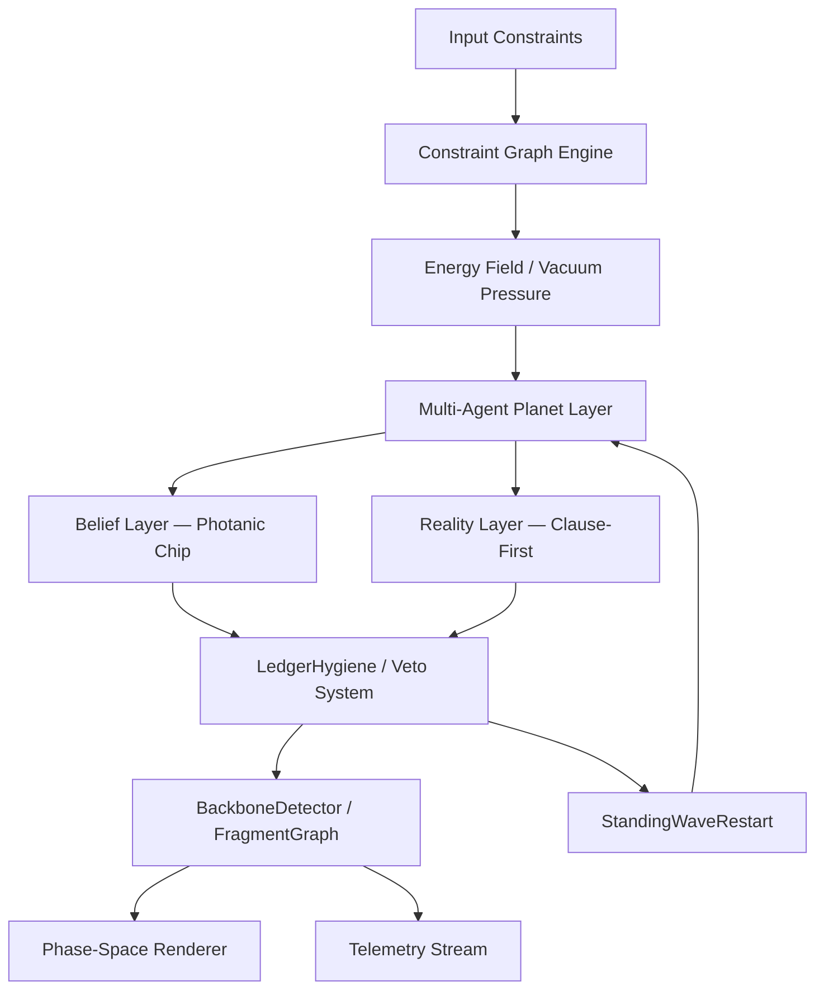

# Ephemeroi


-----

## Overview

**Ephemeroi** is a dynamic constraint reasoning and adaptive intelligence framework where computation is treated as a living system.

Instead of producing static answers, Ephemeroi models problem-solving as:

- evolving state spaces under physical pressure
- energy-driven constraint resolution
- belief vs reality reconciliation with hard veto authority
- emergent solution dynamics through cosmological phase transition

It combines SAT-style constraint solving, multi-agent exploration, photonic signal memory, and real-time phase-space visualization into a unified system grounded in a formal cosmogenesis isomorphism.

-----

## Core Idea: Solving as Cosmogenesis

Ephemeroi reframes solving as physics-like evolution derived from a precise mathematical isomorphism between universe formation and constraint satisfaction:

|Physical Process      |Mathematical Object    |Solver Component         |
|----------------------|-----------------------|-------------------------|
|Formless blobs        |Uniform measure μ₀ on Ω|Random initial assignment|
|Quantum fluctuation   |Phase amplitude Φ(t)   |Phase telemetry          |
|Dark energy           |Vacuum pressure V(σ, F)|Vacuum telemetry         |
|Spiral condensation   |Condensation point i*  |PressureScorer argmax    |
|Vortex / basin        |Basin B(σ*)            |BasinMemory signature    |
|Oscillation knot      |2-cycle                |KernelInterrogator       |
|Radial time axis      |R(t)                   |Flip counter             |
|Phase-lock event      |Phase-lock condition   |AnsonPhaseLock           |
|Universe arrow        |Formula F              |DIMACS CNF input         |
|Crystallized structure|Backbone BB(F)         |BackboneDetector         |
|Residual satellite    |Hard kernel K_hard     |KernelInterrogator       |

Truth is not computed directly — it **emerges from structural pressure over radial time**.

The drawing is not metaphor dressed up as code. It is a **compressed specification**. Every subsystem in Ephemeroi corresponds to a physical process in cosmogenesis: the sketch predicts the architecture.

-----

## Dynamical System

The Ephemeroi solver is defined as a discrete dynamical system over assignment space Ω = {0,1}^n:

```
V(σ, F)  = |{c ∈ F : c unsatisfied by σ}|        (vacuum pressure)
Φ(t+1)   = (1-ρ)·Φ(t) + ρ·|σ(t+1) - σ(t)|       (phase field update)
i*(t)    = argmax_{v} pressure(v, σ, F)            (condensation point)
B(σ*)    = {σ : basin_signature(σ) = basin_signature(σ*)}  (vortex)
```

Fixed points of this system are satisfying assignments. The transient is the cosmogenesis: a journey from maximum-entropy chaos through condensation to crystallized backbone structure.

**Phase-lock** occurs when Φ(t) stabilizes — the solver has found its attractor and backbone variables can be safely crystallized.

-----

## System Architecture



-----

## Components

### 1. Constraint Engine

- SAT-inspired resolution system with stochastic local search
- Tracks clause satisfaction and conflicts as vacuum pressure buildup
- Converts logical constraints into dynamic pressure fields
- Supports backbone locking, hinge cascades, and CFH-Zero dual-mode resolution

-----

### 2. Dual-Layer Cognition System

The most significant architectural innovation in Ephemeroi is the formal separation of belief from reality — a distinction with no direct precedent in SLS literature.

#### Belief Layer — Photanic Chip

The Photanic Chip is a memory and signal-processing layer inspired by photonic physics:

- **PhaseCoherenceScore (PCS)**: measures alignment between a variable's current value and its historical satisfaction pattern
- **CavityPressureField**: models resonance buildup in clause neighborhoods
- **PhotonHistory**: accumulates directional signal over time (photon ledger)
- **ClauseCoupling**: tracks co-satisfaction relationships between variable pairs
- **Brewster Gate**: write condition derived from the Brewster angle analogy — a ledger entry is only written when the signal arrives at the correct incidence angle (velocity threshold + phase alignment). Velocity=0 on initialization caused the gate to never fire; this required explicit physical grounding.
- **StandingWaveRestart (SWR)**: seeded restart triggered when a second-best assignment is available, replacing random restart chaos with structured re-entry

#### Reality Layer — Clause-First Ground Truth

- Direct evaluation of constraint satisfaction from scratch every cycle
- No trust weighting, no ledger influence — raw clause evaluation only
- Identifies which variables are implicated in unsatisfied clauses
- **Has absolute veto authority over all Belief Layer outputs**
- Reality Layer cannot be overridden by any trust value

#### Veto / Hygiene System (LedgerHygiene)

This module implements the critical insight that **high trust ≠ correct**:

> A variable can reach trust=0.875, be soft-locked, seed restarts, guide resonance — and still be implicated in unsatisfied clauses. The system calls this confidence. It is hallucination.

**Deceptive Coherence**: the state where high photonic trust coexists with continued clause violation. The system agrees with itself. Reality disagrees. Reality is right.

The hygiene system includes:

- **DeceptiveCoherenceDetector**: flags any ledger entry where trust > threshold AND variable appears in unsat clauses
- **CyrusEdict**: structured override sequence — forces adversarial probe on deceptive variables, resets ledger trust, reclassifies to DECEPTIVE tier
- **SelectiveMemoryPressure**: only productive restarts (those that reduce unsat count) are allowed to accumulate trust. Sterile restarts do not write to ledger.

```
Tier hierarchy (var_lock_tier):
  DECEPTIVE → highest adversarial priority, force probe
  HARD_LOCK → backbone-confirmed, immutable
  SOFT_LOCK → high trust, tentative
  FREE      → open exploration
```

-----

### 3. Phase-Space Dynamics

Ephemeroi treats solution space as a geometric field:

- nodes = variables
- edges = constraint relations
- forces = logical pressure (vacuum field)
- motion = solver trajectory through Ω
- attractors = satisfying assignments (V=0)

**Radial time** R(t) is the flip counter — not wall-clock time but structural time measured in discrete state transitions. Phase-lock is detected when the phase field Φ(t) stabilizes below threshold.

This enables convergence visualization, instability detection, and attractor discovery.

-----

### 4. Fragment Graph and Squirrel Problem

**FragmentGraph** partitions the variable space into co-satisfying clusters. Each fragment is an autonomous agent with:

- vars: variable set
- values: preferred assignment
- resonance: harmonic confidence score
- stable: consecutive clean-CFH rounds
- bias: accumulated signal from overlapping fragments

**FragmentEvolver** runs trust-weighted voting when fragments disagree on a shared variable's orientation. Two fragments disagreeing on variable v play out a trust-weighted vote rather than the higher-resonance fragment blindly winning.

#### The Squirrel Problem

The squirrel problem is the central failure mode of basin-based solving:

> **Basin self-reinforcement** causes wrong backbone locks. A solver operating from inside a basin will probe a variable while already biased by that basin's local energy landscape — confirming the wrong value because the probe never escaped the gravitational well.

The fix: probes must run from **outside** the basin, with the candidate forced to its opposite value in a fresh random assignment context. This adversarial probe approach prevents self-confirmation.

The squirrel problem propagates recursively: if the fragment graph itself was seeded from a basin-contaminated backbone, fragment graduation inherits the wrong orientation. CFH-Zero seeding cannot be trusted until the fragment graph has been adversarially probed at the fragment level.

-----

### 5. CFH-Zero Dual-Mode Resolver

**CFH (Cross-Fragment Hinge)**: an unsatisfied clause where more than one hinge literal is present and none satisfy — measuring intra-hinge tension rather than total clause count.

**CFH-Zero** fires when:

- hinge variables are fully aligned (last_conflict_between == 0)
- global unsat is at floor

In CFH-Zero mode, the resolver switches from stochastic local search to deterministic backbone crystallization, locking the hinge assignment and propagating constraints outward.

Definition precision matters: counting unsat clauses where >1 hinge literal is present AND none satisfy (not all-clause intra-hinge tension) reduced reported CFH from ~26 to 0-1 and enabled stable accumulation.

-----

### 6. Backbone Detection

**BackboneDetector** identifies variables whose value is invariant across all satisfying assignments — the crystallized structure in the cosmogenesis isomorphism.

Adversarial probe protocol:

1. Generate fresh random assignment (escape current basin)
1. Force candidate variable to opposite of current assignment
1. Run local search from this starting point
1. If the candidate flips back: its current value is likely backbone
1. If it stays opposite: current assignment is likely wrong

Wrong locks drop to near-zero with adversarial probing at the global level. Fragment-level adversarial probing is the open frontier.

-----

### 7. Multi-Agent Exploration System (Planets)

Multiple planet agents explore solution space simultaneously:

- independent traversal strategies with localized energy landscapes
- elite planet registry: high-performing assignments preserved and protected
- kamikaze agents: targeted high-variance explorers for escaping local optima
- surgical precision agents: fine-grained flip targeting near the floor
- emergent coordination through shared global-best assignment propagation

-----

### 8. Telemetry Streaming Engine

Real-time system introspection:

- vacuum pressure V(σ, F)
- phase field Φ(t)
- constraint satisfaction ratio
- conflict density and energy distribution
- belief vs reality divergence (deceptive coherence count)
- backbone lock count and trust tier distribution
- convergence stability index

Feeds the constellation visualization layer as a live data stream.

-----

### 9. Constellation Visualization Frontend

A live scientific interface representing solver behavior as:

- evolving graph structures in phase space
- force-field visualization of vacuum pressure
- animated convergence flows along radial time
- instability "storms" in state space (CFH spikes, deceptive coherence events)
- backbone crystallization events

Not a dashboard — a live instrument panel for reasoning systems.

-----

### 10. Digital Human Extension (Experimental)

A higher-level agent layer that:

- navigates structured environments (including the internet)
- adapts based on feedback loops derived from the belief/reality split
- evolves preference and exploration strategies under constraint pressure
- branches into multiple exploratory selves (multi-agent fragmentation)

Goal: simulate curiosity-driven adaptive intelligence grounded in constraint-satisfaction dynamics.

-----

## Key Theoretical Innovations

### Deceptive Coherence (named phenomenon)

When a variable accumulates high photonic trust through repeated co-satisfaction while remaining implicated in unsat clauses, it creates a **hallucination core** — the solver believes it has found structure that reality does not support. No direct equivalent exists in SLS literature.

### Belief/Reality Split with Hard Veto

The separation of a learned coherence signal (Belief Layer) from clause-first ground truth (Reality Layer) with Reality holding absolute veto authority is structurally distinct from existing trust-weighted SLS methods. The veto is unconditional — no trust value can override a Reality Layer flag.

### Brewster Gate Write Condition

Analogous to Brewster's angle in optics: a ledger write occurs only when the signal arrives at the correct incidence angle (phase alignment × velocity threshold). This prevents premature trust accumulation during early oscillation.

### Standing Wave Restart

Rather than random restart seeding, SWR uses the second-best known assignment as a structured re-entry point — preserving basin-adjacent information while escaping local optima.

### Selective Memory Pressure

Trust accumulates **only** from productive restarts (restarts that reduce the unsat count). Sterile restarts do not write to the ledger. This prevents the ledger from encoding failed exploration as signal.

### Cosmological Isomorphism as Design Methodology

The hand-drawn cosmogenesis sketch → mathematical formalization → subsystem architecture pipeline has **predictive power**: it generated the KernelInterrogator architecture before implementation began. The drawing contains exactly as much information as the solver.

-----

## Repository Structure

```
ephemeroi/
│
├── core/
│   ├── solver_engine/          # SLS main loop, planet agents
│   ├── constraint_graph/       # Clause evaluation, vacuum pressure
│   └── energy_model/           # Phase field, radial time
│
├── cognition/
│   ├── belief_layer/           # Photanic Chip v3 (PCS, cavity, ledger)
│   ├── reality_layer/          # Clause-first ground truth
│   └── veto_system/            # LedgerHygiene, DeceptiveCoherenceDetector, CyrusEdict
│
├── structure/
│   ├── backbone_detector/      # Adversarial probe, crystallization
│   ├── fragment_graph/         # FragmentGraph, FragmentEvolver, trust voting
│   └── hinge_cascade/          # CFH-Zero, hinge alignment, dual-mode resolver
│
├── agents/
│   ├── planet_agents/          # Multi-agent explorer layer
│   ├── elite_registry/         # Best-assignment preservation
│   └── coordination/           # Kamikaze, surgical, global-best propagation
│
├── telemetry/
│   ├── stream_engine/          # Real-time metric output
│   └── metrics/                # Phase, vacuum, deception, backbone telemetry
│
├── frontend/
│   ├── landing/                # Landing page (metacog/ephemeroi split interface)
│   │   └── index.html
│   ├── metacog/                # (TODO) Synchronous reasoning interface
│   ├── ephemeroi-dashboard/    # (TODO) Autonomous system dashboard
│   ├── shared/                 # (TODO) Common utilities, API client
│   └── README.md               # Frontend service documentation
│
├── simulation/
│   ├── environments/           # Benchmark instances (100v/430c/seed42 canonical)
│   └── test_cases/             # Smoke tests, adversarial probes, regression
│
└── README.md
```

-----

## Frontend Services

The system includes a **dual-interface architecture**:

### Metacog (Synchronous)
- **Mode**: Real-time, user-driven reasoning
- **Route**: `/`
- **UX**: Ask a question → watch it think step-by-step with visible retrieval lenses
- **Memory**: Browser localStorage with déjà vu recall
- **Status**: Landing page complete, interface implementation pending

### Ephemeroi Dashboard (Autonomous)
- **Mode**: Background, persistent worldview construction
- **Route**: `/ephemeroi/`
- **UX**: Check in on beliefs that evolved while you slept, see tensions and reports
- **Memory**: Server-side belief store with confidence tracking
- **Status**: Landing page complete, interface implementation pending

**Landing Page** (`frontend/landing/index.html`):
- Single-file HTML with inline CSS + JavaScript
- Explains the metacog/ephemeroi duality
- Animated telemetry stream, belief confidence bars
- Responsive design with cosmogenesis-inspired styling

See [`frontend/README.md`](frontend/README.md) for full frontend architecture and development roadmap.

-----

## Benchmark

Canonical benchmark: **100 variables, 430 clauses, seed=42, ratio=4.30** (confirmed SAT by DPLL oracle).

Target: `unsat=0`. Current persistent floor: `unsat=2–3` requiring fragment-level adversarial squirrel resolution.

-----

## One-Line Summary

Ephemeroi is a dynamic constraint intelligence system where solving is cosmogenesis, belief is hypothesis, reality holds veto authority, and truth emerges through continuous structural pressure along radial time.
